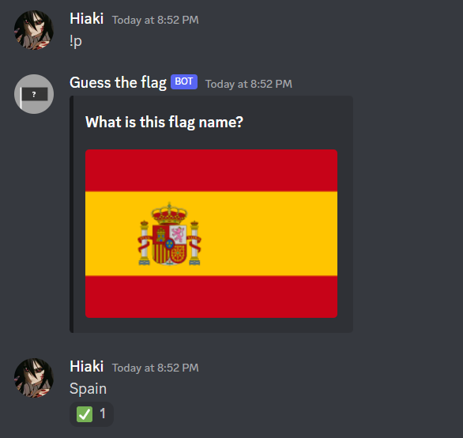

# Discord-flag-bot
Project to learn more python and discord API

# Screenshot

# How to play
Type the command '!p', after that the overview of the game will appear, then type the name of the country that appears. If you get the answer right the bot will react with ✅.(the names of the countries existing in the bot are located in the command '!fl')

# Things to add
•Error system (when the user misses the name, bot react with '❌') 
•Hit count 
•Keep showing flags when the user hits the name 
•Optimize image and name link system
