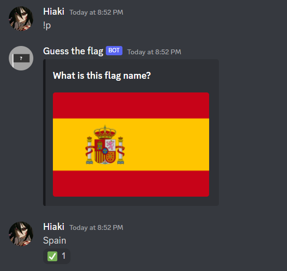

# Discord-flag-bot
Project to learn more python and discord API

# Screenshot

# How its work
Typing the command '!p', the bot shows a flag image, after this you type the name, if you hit the bot react with "✔️".
